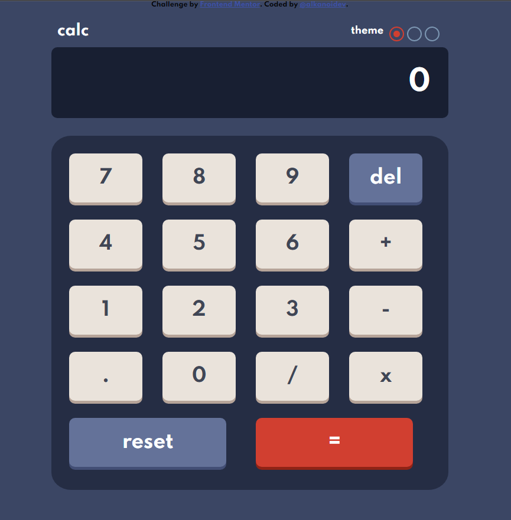
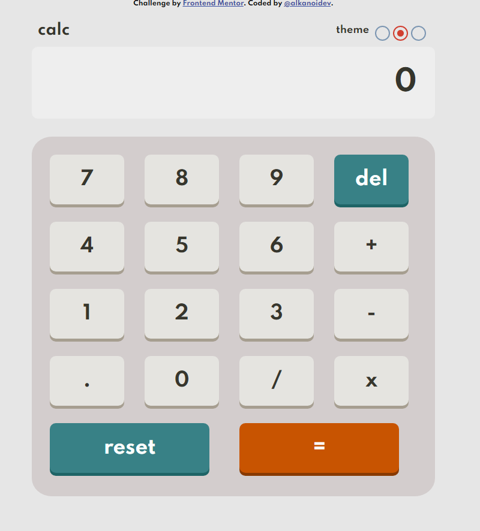
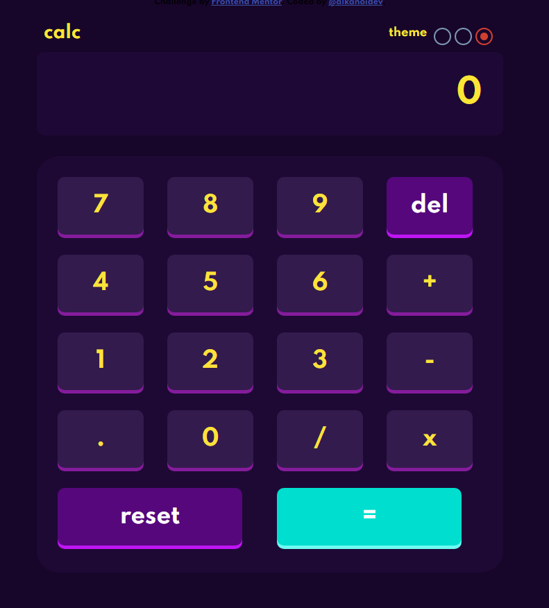

# Frontend Mentor - Calculator app solution

This is a solution to the [Calculator app challenge on Frontend Mentor](https://www.frontendmentor.io/challenges/calculator-app-9lteq5N29). Frontend Mentor challenges help you improve your coding skills by building realistic projects. 

## Overview

### The challenge

Users should be able to:

- See the size of the elements adjust based on their device's screen size
- Perform mathmatical operations like addition, subtraction, multiplication, and division
- Adjust the color theme based on their preference
- **Bonus**: Have their initial theme preference checked using `prefers-color-scheme` and have any additional changes saved in the browser

### Screenshot

<p float="left">
  <code></code>
  <code></code>
  <code></code>
</p>

### Built with

- Semantic HTML5 markup
- SCSS custom properties
- Flexbox
- Grid
- Mobile-first workflow
- Vanilla JavaScript
- localStorage
- JavaScript modules

### Something I'm proud of:
```js
window.onload = () => {
  preferences = localStorage.getItem("theme");
  document.documentElement.className = `theme${preferences}`;
  radios[Number(preferences)-1].checked=true;
};
```

```js
firstOperand = displayValue.split(operator)[0];
secondOperand = displayValue.split(operator).pop();
```

```css
.buttons {
  display: grid;
  width: 100%;
  grid-template-columns: 1fr 1fr 1fr 1fr;
  grid-template-rows: 1fr 1fr 1fr 1fr 1fr;
  gap: 10px;
  grid-template-areas:
    ". . . ."
    ". . . ."
    ". . . ."
    ". . . ."
    "reset reset equals equals";
  height: 600px;
}
```

## Author

- Email - alkanoidev@gmail.com
- Frontend Mentor - [@alkanoidev](https://www.frontendmentor.io/profile/alkanoidev)
@alkanoidev
